# LNMIIT Room Allotment and Complaint Management - 2023

Welcome to the documentation for the **LNMIIT Room Allotment and Complaint Management System** for the year 2023. This project is designed to streamline the room allotment process for students and manage their complaints effectively. The system includes features for both students and wardens of LNMIIT.

## Table of Contents

- [Introduction](#introduction)
- [Features](#features)
- [Getting Started](#getting-started)
  - [Prerequisites](#prerequisites)
  - [Installation](#installation)
- [Usage](#usage)
  - [Warden Controls](#warden-controls)
  - [Student Interface](#student-interface)
- [Google Authentication](#google-authentication)
- [User Types](#user-types)
- [Make an Announcement](#make-an-announcement)
- [Queries and Support](#queries-and-support)

## Introduction

The LNMIIT Room Allotment and Complaint Management System is a web-based application designed to simplify and optimize the process of room allotment for students and handle their complaints efficiently. The system is equipped with features that allow wardens to control the room allotment process, students to apply for room allotment and submit complaints, and everyone to view announcements made by the wardens.

## Features

- **Warden Controls:**
  - Enable or disable the room allotment process with a simple button click.
  - Download the current list of student allotments in PDF format.
  - Make announcements visible to all users. **and many more**

- **Student Interface:**
  - Apply for room allotment when enabled by the warden.
  - Submit room swap queries.
  - Lodge complaints and track their status.
  - View the status of room allotment and complaint queries **and many more**

## Getting Started

### Installation

1. Clone the project repository from GitHub.
2. Navigate to the project directory and open the terminal and enter command npm i to install dependencies and then npm run dev to run the project.
3. The system will prompt you to a screen which have warden and student panel beside view announcement and you need a active internet connection to login and proceed.

## Usage

### Warden Controls

1. **Log in:** Use your LNMIIT email account (with the `lnmiit.ac.in` domain) to log in as a warden 
2. **Room Allotment Process:** Enable or disable the room allotment process by toggling the button.
3. **Download Allotment List:** Download the current list of student allotments in PDF format.
4. **Make an Announcement:** Create announcements that will be visible to everyone visiting the system, even without logging in.
   **and many more.**
### Student Interface

1. **Log in:** Use your LNMIIT email account (with the `lnmiit.ac.in` domain) to log in as a student.
2. **Room Allotment Application:** Apply for room allotment when the process is enabled by the warden.
3. **Room Swap Query:** Submit a query if you wish to swap rooms with another student.
4. **Lodge Complaint:** Report any issues or complaints you have.
5. **Query Status:** Track the status of your room allotment, room swap, and complaint queries.
**and many more.**

## Google Authentication

- Use your LNMIIT email account for authentication for warden login:
  - `example@lnmiit.ac.in` (Warden)
- Use your regular gmail account for authentication for warden login:
  - `yourrollnumber@gmail.com` (Student)

## User Types

- **Warden:** An official warden with an LNMIIT email account.
- **Student:** An LNMIIT student with an LNMIIT email account.

## Make an Announcement

- Wardens can make announcements visible to all users, providing important information and updates.

## Queries and Support

For any issues, queries, or support related to the LNMIIT Room Allotment and Complaint Management System, please contact:

- Warden Support
- Chief Warden

**Contact details are mentioned in the contact section of student login.**

---

Thank you for using the LNMIIT Room Allotment and Complaint Management System. We hope this system enhances your experience and makes the room allocation process smoother.

## Below are few images of the working project at local host 5000**

### Start Page
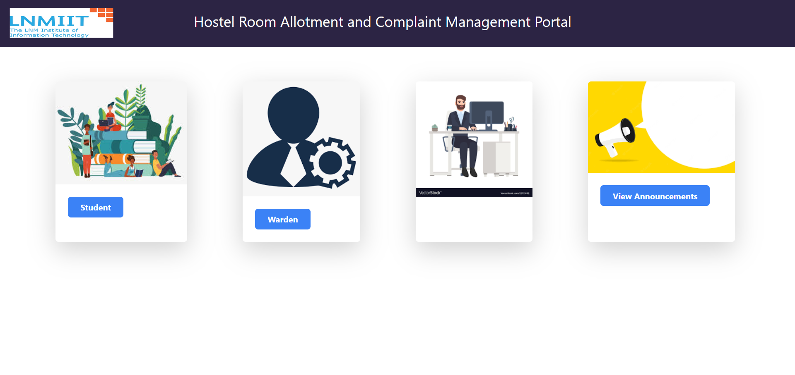
### google authentication using firebase
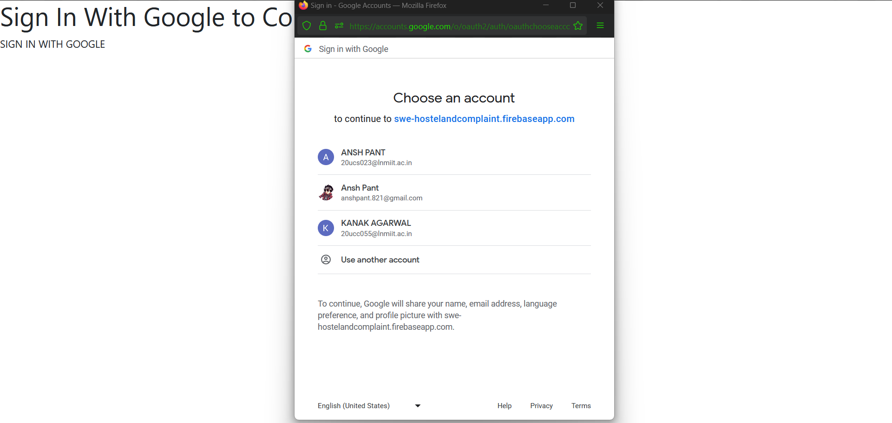
###  student section
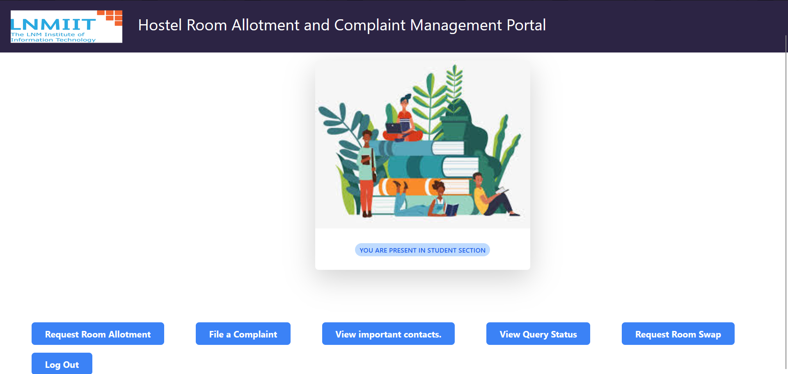
### student going for room allotment when it is enabled
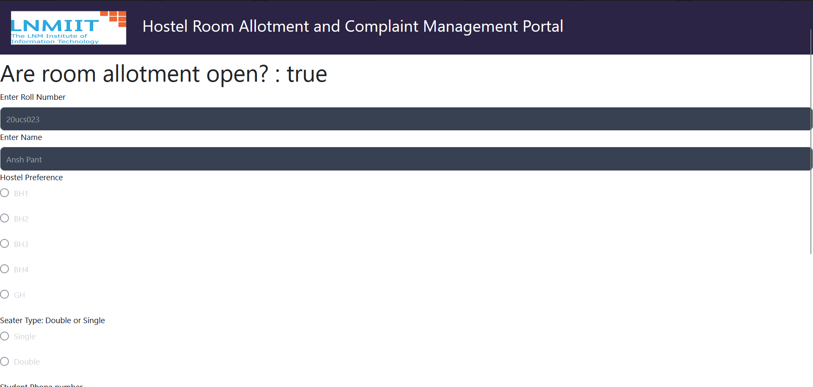
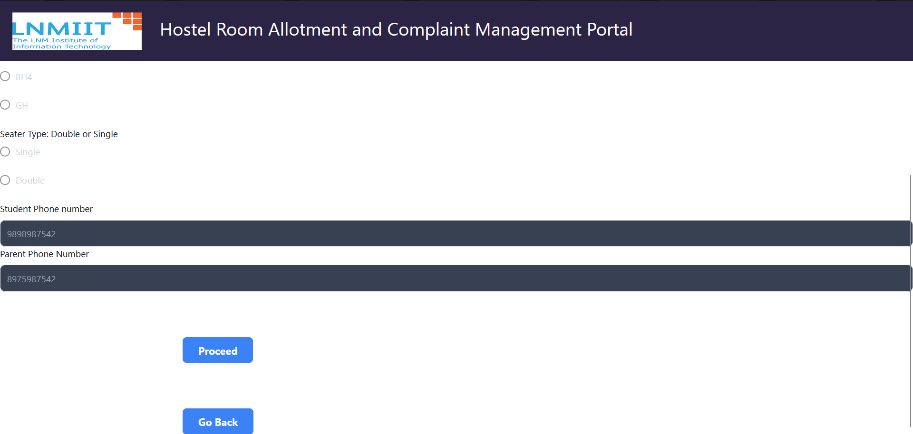
### Student filing a complaint
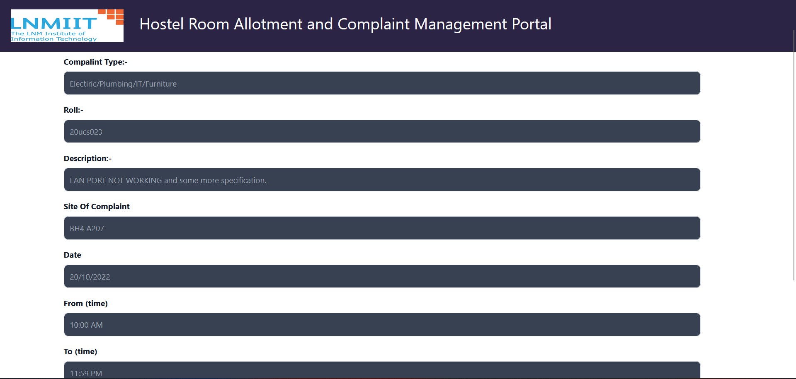
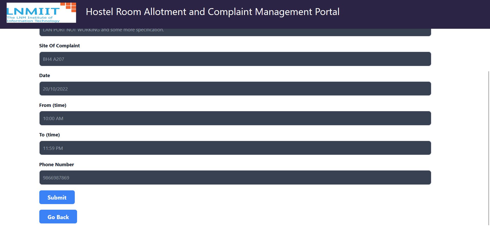
### Contact Details of Hostel Staff,Caretaker and Warden fetched from firestore
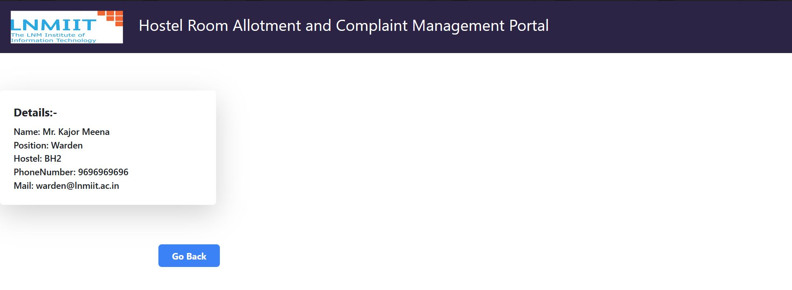
### Displaying complaint details by roll number of institute
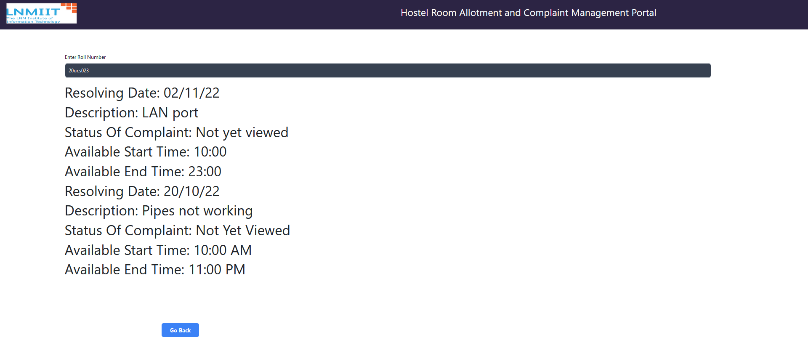
### Swap room request portal
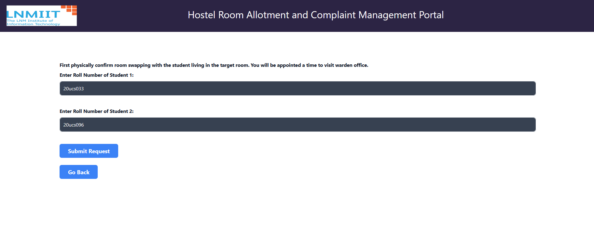
### Entry made in the backend for swapping rooms
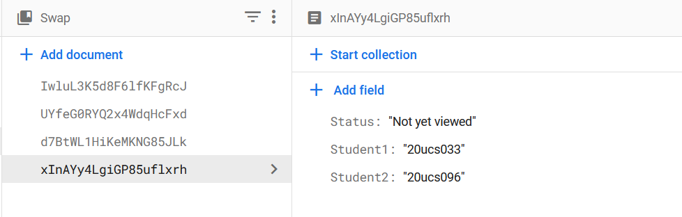
### Log out
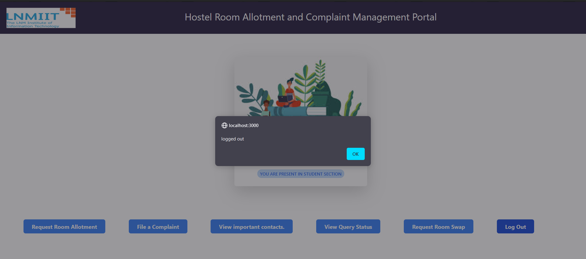
### Enabling of room allotment in warden login
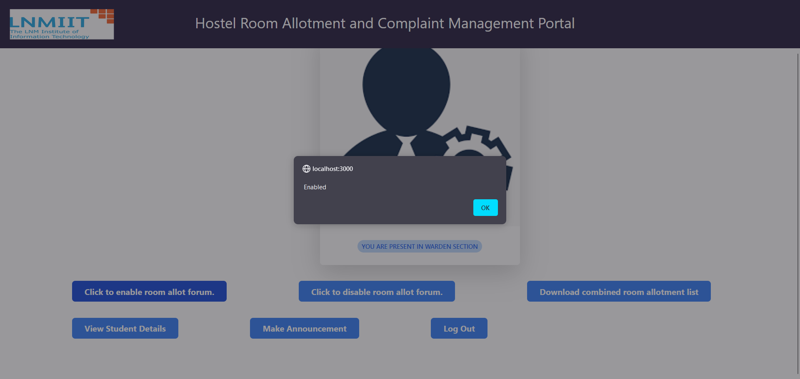
### Disabling of room allotment in warden login
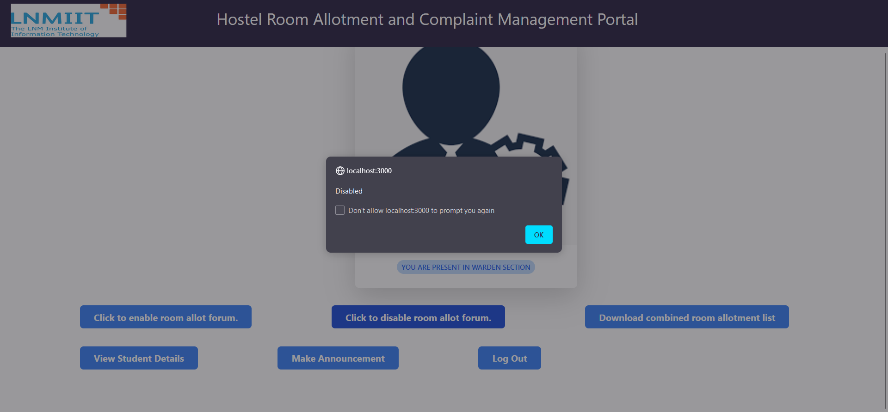
### Downloading Current room allotment (Feature available to warden)
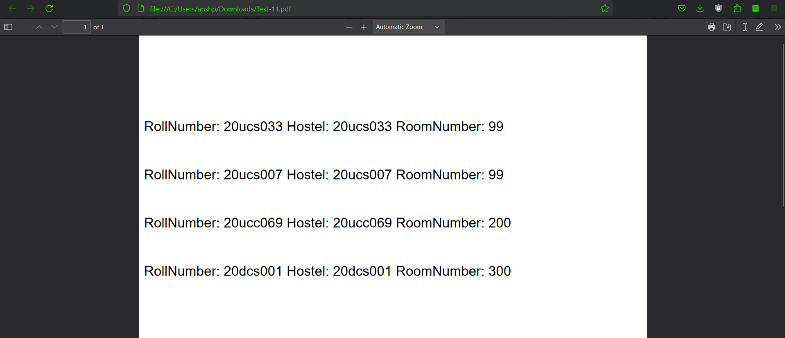
### Warden Making an announcement
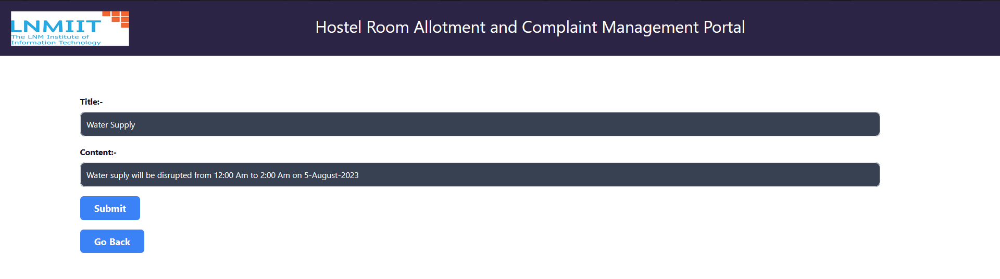
### Both student and Warden searching for the student complaint and its status by its roll number
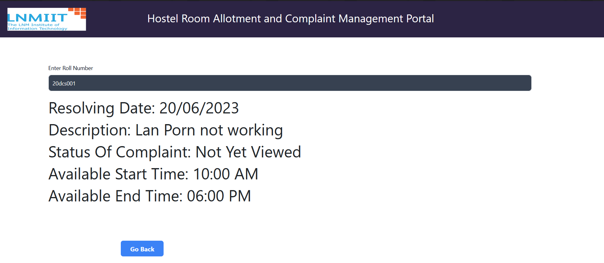
